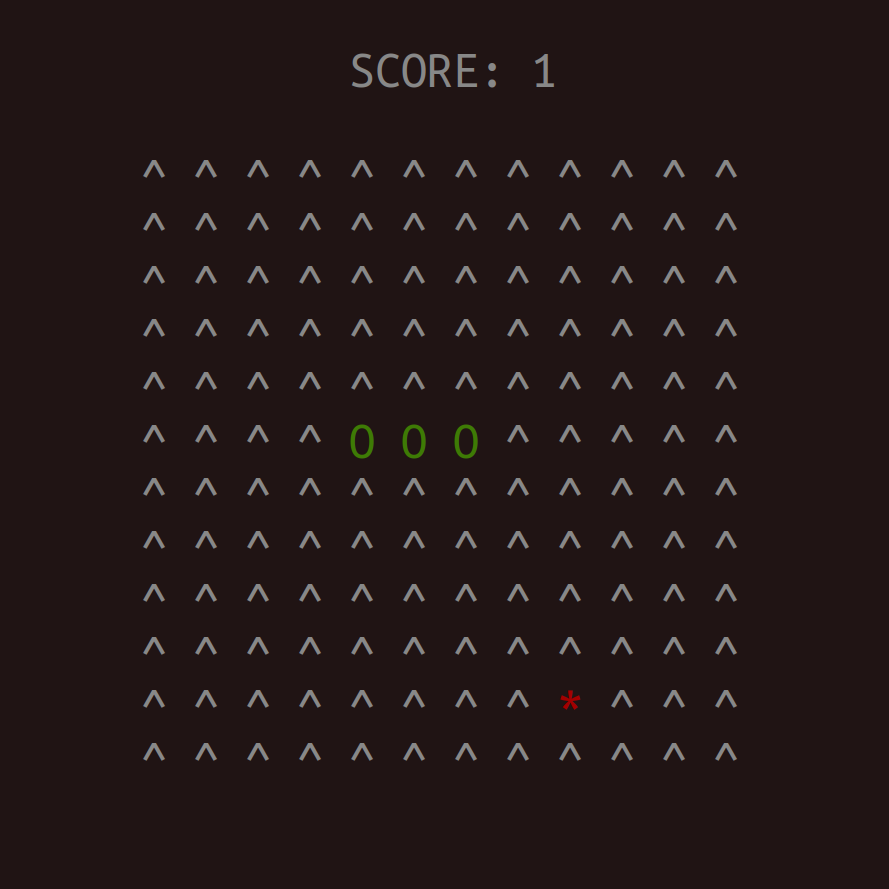

## Snake game in the terminal using Python:
### Uses 'curses' module.

#### Install `curses`:
Check whether 'curses' module is installed.

#### Edit `configs.py`:
Change the settings to your liking.

#### `./game.py`:
Run it! 
